# An Analysis of the European Modal Split on a National and Urban Level</h1>
*A hands-on interactive study on the traffic behaviour in Europe*
 
 
by
 
Marcus Steinbacher
 
 

 

**Abstract**

This study investigates european national (NUTS 1-3) and urban traffic behaviour based on data from Eurostat, Unided Nations and Gapminder. I present several interactive applications to investigate the correlation between socio-economic metrics and traffic data on a temporal and local dimension.  
The interactive analysis provides a healthy basis for the identification and extraction of relevant features features for a regional K-Means clustering of countries and cities. Furthermore, I conduct a Time-Series K-Means clustering of cities.  
The hyperparameter-tuned models reveal three types of countries that share similar features as well as four kinds of cities. A urban temporal clustering application presents the optmial clusters (optimal hyperparameters) for each feature individually.
 
 
**Keywords**: Modal Split, NUTS, Cluster, K-Means, Time Series Cluster.
 

## 1 Introduction
The European traffic modal split, particularly in urban areas, presents a dynamic and complex picture influenced by various factors such as city size, infrastructure, and cultural attitudes toward transportation. Understanding these patterns is crucial for developing sustainable mobility solutions that help improving the overall quality of life - considering a increasing urbanization, this is particularly relevant in cities.  
We'll see that urban areas in Europe can be broadly categorized into several types based on their traffic behavior and socio-economic properties. Major metropolitan centers like London, Paris, and Berlin, characterized by extensive public transportation networks, typically see high usage of buses, trams, and subways. In contrast, mid-sized cities such as Vienna, Copenhagen, and Zurich exhibit a balanced modal split, with significant portions of the population relying on cycling and walking due to well-developed infrastructure for non-motorized transport. Smaller cities and towns on the other hand, often lack extensive public transit options, displayind higher reliance on private vehicles.  
The study is structured as follows: Section 2 briefly presents the data under investigation, section 3 interactively explores the different datasets. The feature engineering and missing data imputation in section 4 prepares the data for a correlation analysis in section 5 and the (Time-Series) K-Means clustering in section 6. Finally, i conclude the major findings in section 7.  
*Note: This paper demonstrates just a reduced set of vizualizations and applications. All applications can be found in the attached jupyter notebook*

## 2 Data
I join data of 15 Eurostat datasets on national, regional and urban level (granularity), 3 UN ECE  datasets on a national level and 7 national Gapminder datasets. All information is joined with geographical data, i.e. coordinates, to further increase the informative value of the data.  
Joining data which has the level of granularity results in 3 major dataframes: All features from the three different providers on national level `df_national`, on a regional, i.e. NUTS 2-3, level `df_eurostat_regio`, and on an urban level `df_urban`. 

## 3 Data Exploration & Vizualisation
### 3.1 National
A comparison of all Eurostat national level features for a sub-selection of countries in a specified year. One can choose to show the absolute value of the features or a min-max-scaled version, where the maximum feature value over all countries is scaled to 1 and the minumun to 0. 

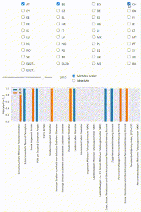

 
To investigate the development of certain feature among a sub-set of countries one can compare their time series. 

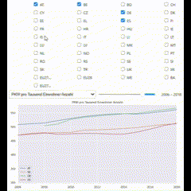

 
Adding the geographical dimension we can run two features for each country against each other to get an idea about possible correlations. 

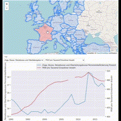

 
Finally, a Choropleth map compares the magnitude of an arbitrary feature in a given year among all countries. 

### 3.2 Regional
Regarding the regional granularity I inspect the levels NUTS 0-2 

 
A Choropleth map lets us break down an arbitrary feature (here: Features from the Gapminder Dataset(s)) to the desired regional level and year 

### 3.3 Urban
Urban data is organized in city kernels (see city center) and their peripheral entities. 

 
A Circle map lets us compare a feature among all cities in a specified year. 

 

## 4 Feature Engineering & Missing Data Handling
Merging all available data and desired features on the same level of regional granularity (e.g. national level) results in two major dataframes `df_national` & `df_urban`. 
 
Comparing a national feature to its european median and mean including an optional 95% confidence interval. 

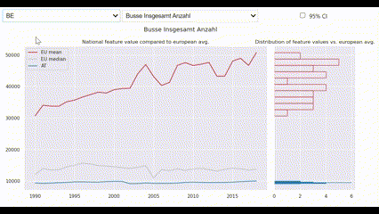

 
We can also compare each features distribution among all member states. 

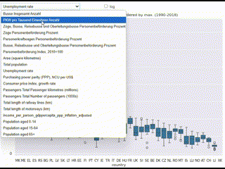

 
Choosing the right imputation strategy for missing values is crucial. Different strategies are applied depending on properties of the individual features, e.g.:

- Intrapolation
- Imputation by EU mean/median
- Extrapolation for marginal values
- Forward/Backward fill
- ...

Finally, We can also inspect the results of the missing data imputation. 

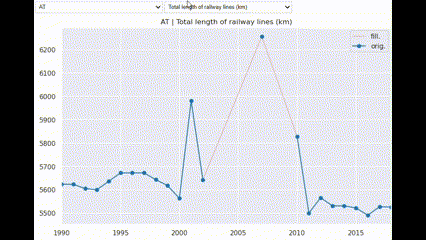

## 5 Correlation Analysis

First, get an idea about possible correlations by visualising a scatterplot of pairwise features for each entity (e.g. member state). 

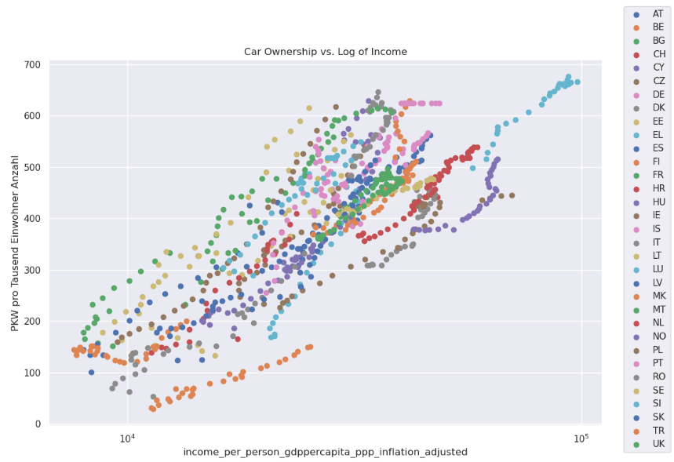

 

Additionally, we can inspect the correlation between all features. 

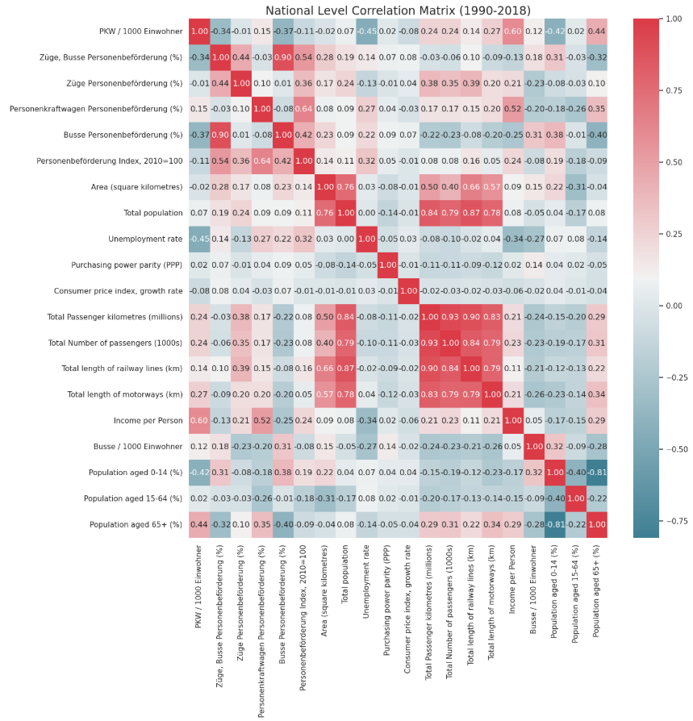

 
But we can also run two time series of features for every entity against each other and inspect a certain period if we want. This can reveal common/contrary trends. 

 

Furthermore, we can study the correlation coefficient of two features among all entities and see how this has changed over time, for eaxmaple, "how has the correlation between `Cars per Person` an `GDP Growth` changed over the time?" 

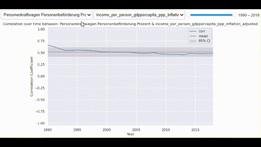

 

## 6 Cluster Analysis
In order to find clusters of states/cities that share the same properties regarding socio-economic values and traffic behavior I scale all features that display total numbers (e.g. `Total Number of Cars`) with the `Total Population`. 

### 6.1 National Cluster
A radar chart of the K-Means(k=3) clustering of all memberstates reveals the (realtive) magnitude of each feature for the three classes. 

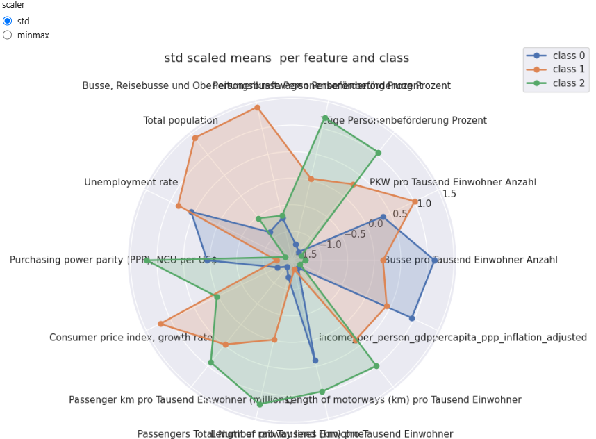

 
We can study the geographical dimension by colouring each country regarding its class. 

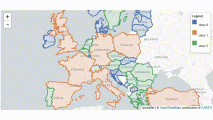

### 6.1 City Cluster
A K-Means(k=4) clustering creates four classes with chare the following properties. 

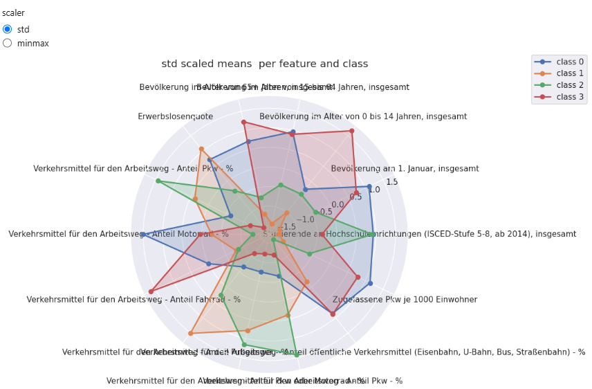

 
Which results in a geographical representation as, 

 
Additionally, we can do a time series clustering that classifies cities that follw a similar trend regarding a specific feature.  

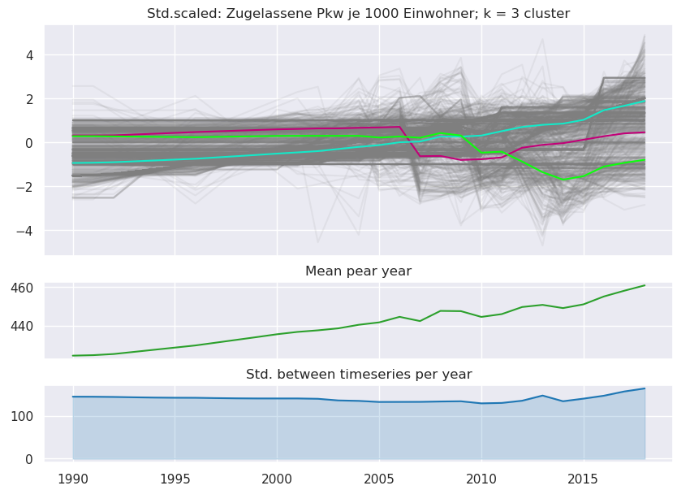

 
Choosing the optimal number of clusters (k) based upon the silhouette score reveals following time series clustering for each feature individually.  

